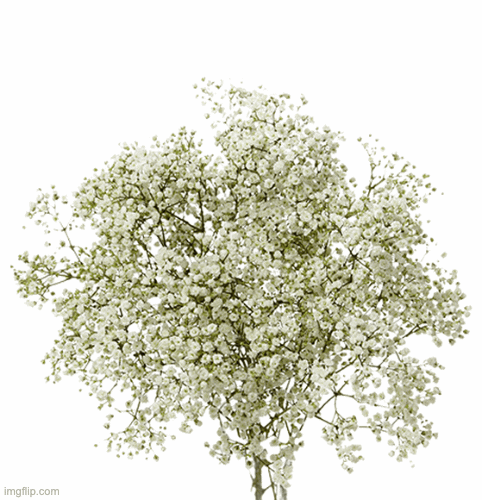
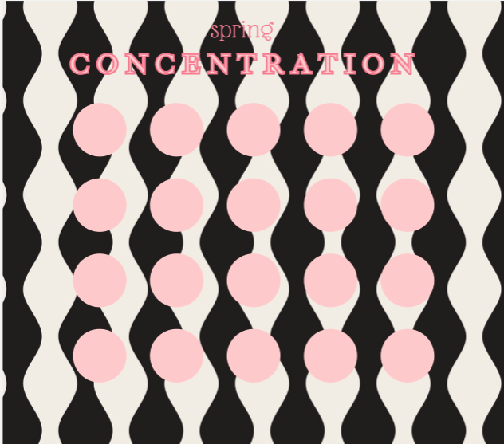
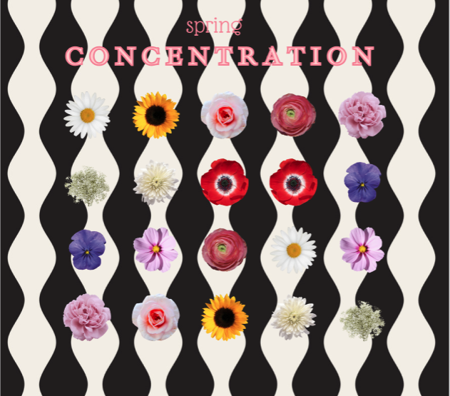
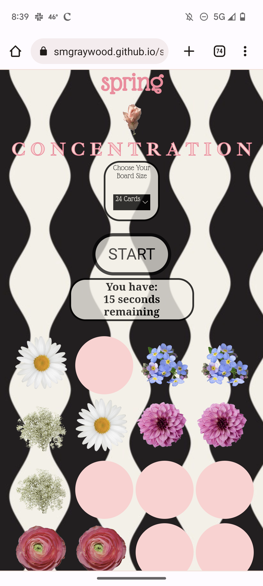
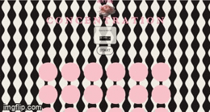

# Go Play! [github.io](https://smgraywood.github.io/spring_concentration/)


<!-- TABLE OF CONTENTS -->
<details>
  <summary>Table of Contents</summary>
  <ol>
    <li>
      <a href="#about-the-project">About The Project</a>
      <ul>
        <li><a href="#built-with">Built With</a></li>
      </ul>
    </li>
    <li>
      <a href="#gameplay">Gameplay</a>
    </li>
    <li><a href="#installation">Installation</a></li>
    <li><a href="#contributing">Contributing</a></li>
    <li><a href="#contact">Contact</a></li>
    <li><a href="#enhancements">Planned Enhancements</a></li>
  </ol>
</details>


# SPRING CONCENTRATION



<!-- ABOUT THE PROJECT -->
## About The Project


A spring flower themed game of concentration inspired by my mother. 
My mother loves plants and flowers and used to take me on botany identification walks as a child.
So, for my first game created for the General Assembly SEI program, I decided to make a game that she would love as much as the superbloom.

* choose board sizes between 4 and 24 tiles
* beautiful spring flowers under each tile
* mobile responsive design
* timer function counting down while game play happens
* planned with [Figma](https://www.figma.com/file/5XNCj2WvwdM3QgI3AMKYlt/SPRING-CONCENTRATION?node-id=0-1&t=PYmLbOoPQuW83ZPu-0)

### Built With


<p align="right">(<a href="#readme-top">back to top</a>)</p>

## Gameplay

When entering the game, a player has several user paths they can take. Gameplay is disabled until the user chooses their board size which will cause divs to disappear based on the number of tiles selected.

Once the user selects a gameboard size and presses play, a timer will start. The timer is set to the same time (60 seconds) for every gameboard size, so the level of difficulty is determined by the gameboard size chosen by the user. 

The user can then navigate through the game by clicking different tiles. If the two tiles are a match, they will stay facing up. However, if the two tiles do not match, they will turn back over after a 1 second delay allowing the user to see what flowers they previously chose while not delaying their ability to play. 

If the user matches all of the tiles within the given time, a message displays at the top of the page telling them that they won. However if the user is unable to make all of the matches in time, the message displayed says "You Lost." 

Feel free to go test it out!
[github.io](https://smgraywood.github.io/spring_concentration/)

These are images from the design process of the game
<br>


<br> 
<br>
This is an example of what the game looks like on mobile
<br>



<br>
<br>
This is a short video of what gameplay might look like
<br>



<p align="right">(<a href="#readme-top">back to top</a>)</p>

### Installation

_Below is an example of how you can instruct your audience on installing and setting up your app. This template doesn't rely on any external dependencies or services._
 
1. Clone the repo
   ```sh
   git clone git@github.com:smgraywood/spring_concentration.git
   ```
2. Get to coding! 😃 

<p align="right">(<a href="#readme-top">back to top</a>)</p>

<!-- CONTRIBUTING -->
## Contributing

Contributions are what make the open source community such an amazing place to learn, inspire, and create. Any contributions you make are **greatly appreciated**.

If you have a suggestion that would make this better, please fork the repo and create a pull request. You can also simply open an issue with the tag "enhancement".
Don't forget to give the project a star! Thanks again!

1. Fork the Project
2. Create your Feature Branch (`git checkout -b feature/AmazingFeature`)
3. Commit your Changes (`git commit -m 'Add some AmazingFeature'`)
4. Push to the Branch (`git push origin feature/AmazingFeature`)
5. Open a Pull Request

<p align="right">(<a href="#readme-top">back to top</a>)</p>

<!-- PLANNED ENHANCEMENTS -->
## Planned Enhancements

- [ ] Reformating divs so that the display of fewer than 24 is cleaner looking
- [ ] when flowers are matched, a short message about the genus of the flower and where and when it grows
- [ ] differing time amounts allowed for different board sizes
- [ ] leaderboard for shortest time making all matches based on board size
- [ ] popup to tell the player that they need to select a board size if they try to click the start button without selecting a board size
- [ ] in game music
- [ ] ability to choose between regular floral deck and a floral deck with CA wildflowers

<p align="right">(<a href="#readme-top">back to top</a>)</p>